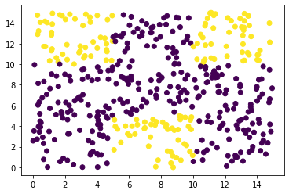

```python
import numpy as np
import math
import matplotlib.pyplot as plt
from sklearn import datasets as ds
```


```python

```


```python
## DECISION TREES ##
```


```python

```


```python
# IRIS DATASET

iris = ds.load_iris();

ir_data = np.c_[iris.data, iris.target];
```


```python
# TRAINING SET - TAKE 40 OUT OF 50 EXAMPLES IN EACH CLASS - 80 % 
training_set = np.r_[ir_data[0:40,:],ir_data[50:90,:],ir_data[100:140,:]];

print("TRAINING SET SHAPE: ", training_set.shape);

# TESTING SET - TAKE THE REMAINING 10 EXAMPLES FROM EACH CLASS - 20 % 
testing_set = np.r_[ir_data[40:50,:], ir_data[90:100,:], ir_data[140:150,:]];

print("TESTING SET SHAPE: ", testing_set.shape);
```

    TRAINING SET SHAPE:  (120, 5)
    TESTING SET SHAPE:  (30, 5)


```python
print(iris.DESCR);
```

    .. _iris_dataset:
    
    Iris plants dataset
    --------------------
    
    **Data Set Characteristics:**
    
        :Number of Instances: 150 (50 in each of three classes)
        :Number of Attributes: 4 numeric, predictive attributes and the class
        :Attribute Information:
            - sepal length in cm
            - sepal width in cm
            - petal length in cm
            - petal width in cm
            - class:
                    - Iris-Setosa
                    - Iris-Versicolour
                    - Iris-Virginica
                    
        :Summary Statistics:
    
        ============== ==== ==== ======= ===== ====================
                        Min  Max   Mean    SD   Class Correlation
        ============== ==== ==== ======= ===== ====================
        sepal length:   4.3  7.9   5.84   0.83    0.7826
        sepal width:    2.0  4.4   3.05   0.43   -0.4194
        petal length:   1.0  6.9   3.76   1.76    0.9490  (high!)
        petal width:    0.1  2.5   1.20   0.76    0.9565  (high!)
        ============== ==== ==== ======= ===== ====================
    
        :Missing Attribute Values: None
        :Class Distribution: 33.3% for each of 3 classes.
        :Creator: R.A. Fisher
        :Donor: Michael Marshall (MARSHALL%PLU@io.arc.nasa.gov)
        :Date: July, 1988
    
    The famous Iris database, first used by Sir R.A. Fisher. The dataset is taken
    from Fisher's paper. Note that it's the same as in R, but not as in the UCI
    Machine Learning Repository, which has two wrong data points.
    
    This is perhaps the best known database to be found in the
    pattern recognition literature.  Fisher's paper is a classic in the field and
    is referenced frequently to this day.  (See Duda & Hart, for example.)  The
    data set contains 3 classes of 50 instances each, where each class refers to a
    type of iris plant.  One class is linearly separable from the other 2; the
    latter are NOT linearly separable from each other.
    
    .. topic:: References
    
       - Fisher, R.A. "The use of multiple measurements in taxonomic problems"
         Annual Eugenics, 7, Part II, 179-188 (1936); also in "Contributions to
         Mathematical Statistics" (John Wiley, NY, 1950).
       - Duda, R.O., & Hart, P.E. (1973) Pattern Classification and Scene Analysis.
         (Q327.D83) John Wiley & Sons.  ISBN 0-471-22361-1.  See page 218.
       - Dasarathy, B.V. (1980) "Nosing Around the Neighborhood: A New System
         Structure and Classification Rule for Recognition in Partially Exposed
         Environments".  IEEE Transactions on Pattern Analysis and Machine
         Intelligence, Vol. PAMI-2, No. 1, 67-71.
       - Gates, G.W. (1972) "The Reduced Nearest Neighbor Rule".  IEEE Transactions
         on Information Theory, May 1972, 431-433.
       - See also: 1988 MLC Proceedings, 54-64.  Cheeseman et al"s AUTOCLASS II
         conceptual clustering system finds 3 classes in the data.
       - Many, many more ...


```python

```


```python
# LOSS FUNCTION : CROSS ENTROPY #
```


```python

```


```python
class Tree:
    def __init__(self):
        self.left = None;
        self.right = None;
        self.feature = None;
        self.threshold = None;
        self.target = None;
```


```python
decision_tree = Tree();

def decisionTreeTrain(dataset, tree, region_cardinality_threshold):

    if len(dataset) <= region_cardinality_threshold:
        tree.target = vote(dataset);
        return tree;
    
    number_of_features = dataset.shape[1] - 1;
    region_1 = None;
    region_2 = None;
    
    entropy_min = math.inf;
    temp_decision = [None,None];
    for f in range(number_of_features):
        dataset_order_f = dataset[dataset[:,f].argsort()]; 
        
        for i in range(dataset_order_f.shape[0] - 1):
            region_1_temp = dataset_order_f[0:(i+1),:];
            region_2_temp = dataset_order_f[(i+1):,:];
            
            entropy_cost = entropyLoss(region_1_temp) + entropyLoss(region_2_temp);
            if entropy_cost < entropy_min:
                entropy_min = entropy_cost;
                region_1 = region_1_temp;
                region_2 = region_2_temp;
                temp_decision[0] = f;
                temp_decision[1] = dataset_order_f[i,f];
                     
    tree.feature = temp_decision[0];
    tree.threshold = temp_decision[1];

    tree.left = decisionTreeTrain(region_1, Tree(),region_cardinality_threshold);
    tree.right = decisionTreeTrain(region_2, Tree(),region_cardinality_threshold);
    
    return tree;
      
    
def entropyLoss(dataset):
    classes = dataset[:,-1];
    classes_unique, counts = np.unique(classes, return_counts=True);
    classes_counts_records = dict(zip(classes_unique, counts));
    
    number_of_examples = np.sum(counts);
    
    entropy_loss = 0;
    for key, value in classes_counts_records.items():
        proportion = value/number_of_examples;
        entropy_loss += -proportion*np.log2(proportion);

    return entropy_loss;

def vote(dataset):
    classes = dataset[:,dataset.shape[1]-1];
    classes_unique, counts = np.unique(classes, return_counts=True);
    classes_counts_records = dict(zip(classes_unique, counts));
    
    return max(classes_counts_records, key = classes_counts_records.get);

```


```python
tab = [None] * 10;
for i in range(10): tab[i] = [];

def printVisualTree(tree):
    
    visual_tree = constructVisualTree(tree, 0, tab);
    
    for i in range(len(visual_tree)): print(visual_tree[i]);
    
    
def constructVisualTree(tree, i, tab):
    
    if tree.target != None:
        tab[i].append(tree.target);
    
    else:
        tab[i].append((tree.feature, tree.threshold));
        tab = constructVisualTree(tree.left, i+1, tab);
        tab = constructVisualTree(tree.right, i+1, tab);
    
    return tab;
```


```python
def decisionTreeTest(testing_set, decision_tree_trained):
    
    prediction_accuracy = 0;
    true_targets = testing_set[:,-1];
    testing_set_size = testing_set.shape[0];
    
    for i in range(testing_set_size):
        true_target = true_targets[i];
        prediction_target = predictionTarget(testing_set[i], decision_tree_trained);
        
        if true_target == prediction_target:
            prediction_accuracy += 1;
    
    return prediction_accuracy/testing_set_size;

def predictionTarget(x, decision_tree_trained):
    
    if decision_tree_trained.target != None:
        return decision_tree_trained.target;
    
    else:
        feature = decision_tree_trained.feature;
        threshold = decision_tree_trained.threshold;
        
        if x[feature] <= threshold:
            return predictionTarget(x, decision_tree_trained.left);
            
        else:
            return predictionTarget(x, decision_tree_trained.right);
```


```python
def optimalDecisionTreeCardinality(training_set, testing_set, tree):
    
    metric_accuracy_cardinality = -math.inf;
    optimal_cardinality = None;
    
    for c in range(100,0,-1):
        decision_tree_train_card = decisionTreeTrain(training_set,tree,c);
        accuracy_decision_tree_train_card = decisionTreeTest(testing_set, decision_tree_train_card);

        objective_function = accuracy_decision_tree_train_card - (1/c);
        
        if objective_function > metric_accuracy_cardinality:
            metric_accuracy_cardinality = objective_function;
            optimal_cardinality = c;
    
    return optimal_cardinality;

print(optimalDecisionTreeCardinality(training_set, testing_set, decision_tree))
```

    79


```python

```


```python
## REGRESSION TREES ##
```


```python

```


```python
diabete_dataset_inf = ds.load_diabetes();

diabete_dataset_data = np.c_[diabete_dataset_inf.data, diabete_dataset_inf.target];

print(diabete_dataset_inf.DESCR);
```

    .. _diabetes_dataset:
    
    Diabetes dataset
    ----------------
    
    Ten baseline variables, age, sex, body mass index, average blood
    pressure, and six blood serum measurements were obtained for each of n =
    442 diabetes patients, as well as the response of interest, a
    quantitative measure of disease progression one year after baseline.
    
    **Data Set Characteristics:**
    
      :Number of Instances: 442
    
      :Number of Attributes: First 10 columns are numeric predictive values
    
      :Target: Column 11 is a quantitative measure of disease progression one year after baseline
    
      :Attribute Information:
          - age     age in years
          - sex
          - bmi     body mass index
          - bp      average blood pressure
          - s1      tc, total serum cholesterol
          - s2      ldl, low-density lipoproteins
          - s3      hdl, high-density lipoproteins
          - s4      tch, total cholesterol / HDL
          - s5      ltg, possibly log of serum triglycerides level
          - s6      glu, blood sugar level
    
    Note: Each of these 10 feature variables have been mean centered and scaled by the standard deviation times `n_samples` (i.e. the sum of squares of each column totals 1).
    
    Source URL:
    https://www4.stat.ncsu.edu/~boos/var.select/diabetes.html
    
    For more information see:
    Bradley Efron, Trevor Hastie, Iain Johnstone and Robert Tibshirani (2004) "Least Angle Regression," Annals of Statistics (with discussion), 407-499.
    (https://web.stanford.edu/~hastie/Papers/LARS/LeastAngle_2002.pdf)


```python
diabete_dataset_data_size = diabete_dataset_data.shape[0];

training_set_db_size = math.floor(diabete_dataset_data_size*0.8);
testing_set_db_size = diabete_dataset_data_size - training_set_db_size; 

# TRAINING SET - 80 % 
training_set_db = diabete_dataset_data[0:training_set_db_size];

print("TRAINING SET DIABETE SHAPE: ", training_set_db.shape);

# TESTING SET - 20 % 
testing_set_db = diabete_dataset_data[training_set_db_size:];

print("TESTING SET DIABETE SHAPE: ", testing_set_db.shape);
```

    TRAINING SET DIABETE SHAPE:  (353, 11)
    TESTING SET DIABETE SHAPE:  (89, 11)


```python

```


```python
# LOSS FUNCTION : VARIANCE #
```


```python

```


```python
# k-Nearest neighbours like regularization;

def regressionTreeTrain(training_set_dbr,k):

    tree = Tree();
    number_of_features = training_set_dbr.shape[1]-1;
    variance_benchmark = math.inf;
    region_1 = None;
    region_2 = None;
    
    if training_set_dbr.shape[0] <= k:
        tree.target = np.mean(training_set_dbr[:,-1]);
        return tree;
    
    for f in range(number_of_features):
        training_set_order_by_f = training_set_dbr[training_set_dbr[:,f].argsort()];

        for i in range(training_set_dbr.shape[0] - 1):
            region_1 = training_set_order_by_f[0:(i+1)];
            region_2 = training_set_order_by_f[(i+1):];
            
            variance_cost = varianceInRegion(region_1) + varianceInRegion(region_2);
            if variance_cost < variance_benchmark:
                variance_benchmark = variance_cost;
                tree.feature = f;
                tree.threshold = training_set_order_by_f[i,f];
    
    tree.left = regressionTreeTrain(region_1,k);
    tree.right = regressionTreeTrain(region_2,k);
    
    return tree;


def varianceInRegion(region):
    return np.var(region[:,-1]);
```


```python
def regressionTreeTest(testing_set_dbr, trained_tree):
    
    mean_square_error = 0;
    mean_absolute_error = 0;
    testing_set_size = testing_set_dbr.shape[0];
    tar_pred = [];
 
    for i in range(testing_set_size):
        target = testing_set_dbr[i,-1];
        prediction = regressionTreePrediction(testing_set_dbr[i,0:-1], trained_tree);
        tar_pred.append((target,prediction));
        
        mean_square_error += (target-prediction)**2;
        mean_absolute_error += np.abs(target-prediction);
        
    return {"mean_square_error":mean_square_error/testing_set_size, "mean_absolute_error":
            mean_absolute_error/testing_set_size, "tar_pred":tar_pred};
        
def regressionTreePrediction(x, trained_tree):
    
    if trained_tree.target != None:
        return trained_tree.target;
    
    feature = trained_tree.feature;
    threshold = trained_tree.threshold;
    
    if x[feature] <= threshold:
        return regressionTreePrediction(x, trained_tree.left);
    else:
        return regressionTreePrediction(x, trained_tree.right);
```


```python

```


```python
# BOOSTING : ADABOOST WITH DECISION TREE STUMPS # 
# https://en.wikipedia.org/wiki/AdaBoost
```


```python
# Here is what the population will roughly look like in this example of application of AdaBoost:

#     0-5 5-10 10-15
#    1|_+_|_-_|_+_| 10-15 
# X2 2|_-_|_-_|_-_| 5-10
#    3|_-_|_+_|_-_| 0-5
#       1   2   3
#           X1

# The objective will be to sample from this population and to observe how AdaBoost with decision tree stumps performs, 
# i.e. the quality of its repesentation of the population.
```


```python

```


```python
rng = np.random.default_rng();
m_ab = 50;

x11 = rng.uniform(0,5,m_ab);
y11 = rng.uniform(10,15,m_ab);
ts11 = np.c_[x11,y11,np.ones(m_ab)];

x12 = rng.uniform(5,10,m_ab);
y12 = rng.uniform(10,15,m_ab);
ts12 = np.c_[x12,y12,-np.ones(m_ab)];

x13 = rng.uniform(10,15,m_ab);
y13 = rng.uniform(10,15,m_ab);
ts13 = np.c_[x13,y13,np.ones(m_ab)];

x21 = rng.uniform(0,5,m_ab);
y21 = rng.uniform(5,10,m_ab);
ts21 = np.c_[x21,y21,-np.ones(m_ab)];

x22 = rng.uniform(5,10,m_ab);
y22 = rng.uniform(5,10,m_ab);
ts22 = np.c_[x22,y22,-np.ones(m_ab)];

x23 = rng.uniform(10,15,m_ab);
y23 = rng.uniform(5,10,m_ab);
ts23 = np.c_[x23,y23,-np.ones(m_ab)];

x31 = rng.uniform(0,5,m_ab);
y31 = rng.uniform(0,5,m_ab);
ts31 = np.c_[x31,y31,-np.ones(m_ab)];

x32 = rng.uniform(5,10,m_ab);
y32 = rng.uniform(0,5,m_ab);
ts32 = np.c_[x32,y32,np.ones(m_ab)];

x33 = rng.uniform(10,15,m_ab);
y33 = rng.uniform(0,5,m_ab);
ts33 = np.c_[x33,y33,-np.ones(m_ab)];

# training_set_ab[i] = [x1,x2,label,weight];

training_set_ab = np.r_[ts11,ts12,ts13,ts21,ts22,ts23,ts31,ts32,ts33];
weights_init = np.ones(training_set_ab.shape[0]);

training_set_ab = np.c_[training_set_ab,weights_init];

fig,ax = plt.subplots();
ax.scatter(training_set_ab[:,0],training_set_ab[:,1],c=training_set_ab[:,2]);
```


    

    


```python
def adaBoostTrain(training_set,number_weak_classifiers):
    
    number_of_features = training_set.shape[1] - 2;
    
    # weak_classifier -> (feature,threshold,alpha,sign of region below threshold (i.e. region_1));
    weak_classifier = None;
    weak_classifiers = [];
    
    while(len(weak_classifiers) <= number_weak_classifiers):
        
        error_rate_benchmark = np.Inf;
    
        for f in range(number_of_features):
            training_set_order_by_f = training_set[training_set[:,f].argsort()];

            for i in range(training_set.shape[0] - 1):
                region_1 = training_set_order_by_f[0:(i+1)];
                region_2 = training_set_order_by_f[(i+1):];

                error_rate_12 = errorRate(region_1,region_2);
                error_rate_21 = errorRate(region_2,region_1);

                if error_rate_12 <= error_rate_21:
                    error_rate = error_rate_12;
                    sign = 1;
                else:
                    error_rate = error_rate_21;
                    sign = -1;

                if error_rate < error_rate_benchmark:
                    error_rate_benchmark = error_rate;
                    alpha = (1/2)*np.log((1-error_rate)/error_rate);
                    weak_classifier = (f,training_set_order_by_f[i,f],alpha,sign);

        weak_classifiers.append(weak_classifier);
        training_set = updateWeights(training_set, weak_classifier, weak_classifiers);
    
    return weak_classifiers;
    
    
def updateWeights(training_set, weak_classifier, weak_classifiers):
    
    label_column = training_set.shape[1] - 2;
    weight_column = label_column + 1;
    feature = weak_classifier[0];
    threshold = weak_classifier[1];
    sign = weak_classifier[3];
    
    for i in range(training_set.shape[0]):
        cm_1_xi = weakClassifiersOutput(training_set[i,0:-2], weak_classifiers);
        yi = training_set[i,label_column];
        
        training_set[i,weight_column] = np.e**(-yi*cm_1_xi);
                   
    return training_set;
        
        
def errorRate(region_plus1, region_minus1):
    
    region_plus1_weighted_error = np.sum(region_plus1[region_plus1[:,2] == -1][:,3]);
    region_minus1_weighted_error = np.sum(region_minus1[region_minus1[:,2] == 1][:,3]);
    total_weighted_sum = np.sum(region_plus1[:,3]) + np.sum(region_minus1[:,3]);
    
    return (region_plus1_weighted_error + region_minus1_weighted_error)/total_weighted_sum;

def weakClassifiersOutput(x, weak_classifiers):

    weak_classifiers_output = 0;
    
    for i in range(len(weak_classifiers)):
        feature = weak_classifiers[i][0];
        threshold = weak_classifiers[i][1];
        alpha = weak_classifiers[i][2];
        sign = weak_classifiers[i][3];
        
        if x[feature] <= threshold:
            weak_classifiers_output += alpha*sign;
        else:
            weak_classifiers_output += alpha*sign*(-1);
        
    return weak_classifiers_output;
```


```python
weak_classifiers = adaBoostTrain(training_set_ab,500);
weak_classifiers[0:10]
```


    [(1, 9.998825295093427, 0.626381484247684, -1),
     (1, 4.985678502163777, 0.4616506381801862, 1),
     (1, 10.326303116459489, 0.3197057282432363, -1),
     (1, 4.985678502163777, 0.22623452197677563, 1),
     (1, 9.998825295093427, 0.19059093461696452, -1),
     (1, 4.985678502163777, 0.15982014800679578, 1),
     (1, 9.998825295093427, 0.1376578419913557, -1),
     (1, 4.985678502163777, 0.12091973115021261, 1),
     (1, 13.911756179998989, 0.10954324179794289, -1),
     (1, 3.642950832598804, 0.13507239947526034, -1)]


```python
## TEST THE PERFORMANCE OF MY STRONG CLASSIFIER (AGGREGATION OF WEAK CLASSIFIERS) IN THE ABOVE POPULATION;

x = np.linspace(0,15);
y = np.linspace(0,15);

points = [];

for i in range(len(x)):
    for j in range(len(y)):
        s = np.sign(weakClassifiersOutput([x[i],y[j]],weak_classifiers));
        
        points.append([x[i],y[j],s]);
```


```python
nppoints = np.array(points);

fig2,ax2 = plt.subplots();
ax2.scatter(nppoints[:,0],nppoints[:,1],c=nppoints[:,2])
```


    <matplotlib.collections.PathCollection at 0x7fd93ccea940>


    

    

