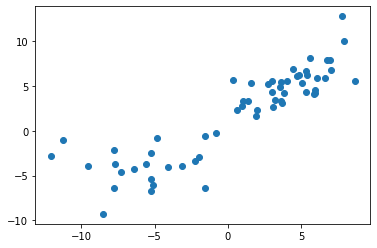
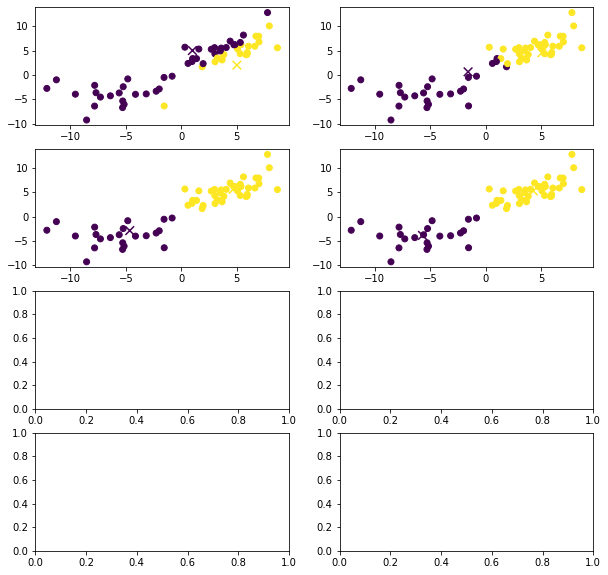

```python
import numpy as np
import matplotlib.pyplot as plt
```


```python

```


```python
## K-MEANS CLUSTERING ##
```


```python
# We define two 2d multivariate normal distributions with means mu_1 and mu_2, 
# and randomly generate one cluster from each of them that will consitute the dataset.

# The objective of k-means clustering (with k=2 in this case) is that each cluster centroid
# to is a good approximation of the mean of one of the multivariate normal distributions. 
```


```python

```


```python
rng = np.random.default_rng();

mu_1 = np.array([4,5]);
sigma_1 = np.array([[6,5],[5,6]]);
cluster_size_1 = 40;

mu_2 = np.array([-5,-5]);
sigma_2 = np.array([[8,2],[2,8]]);
cluster_size_2 = 20;

dataset_in = np.r_[rng.multivariate_normal(mu_1,sigma_1,cluster_size_1),
                rng.multivariate_normal(mu_2,sigma_2,cluster_size_2)];

dataset_in = np.c_[dataset_in,-np.ones((cluster_size_1 + cluster_size_2))];

fig1,ax1 = plt.subplots();
ax1.scatter(dataset_in[:,0],dataset_in[:,1]);
```


    

    


```python
def kMeans(dataset, mu_hat, number_of_iterations, visualize_kmeans = True):
    
    k = len(mu_hat);
    datasets_clusters = np.ndarray((number_of_iterations + 1,len(dataset)));
    mu_hats = np.ndarray((number_of_iterations + 1,len(mu_hat),len(mu_hat[0])));
    
    datasets_clusters[0] = dataset[:,-1];
    mu_hats[0] = mu_hat;    

    loop = 0;
    while(loop < number_of_iterations):
        loop += 1;
        
        for i in range(len(dataset)):
            distance_benchmark = np.Inf;
                        
            for m in range(k):
                distance  = np.linalg.norm(dataset[i,0:-1] - mu_hat[m]);
                
                if distance < distance_benchmark:
                    distance_benchmark = distance;
                    dataset[i,-1] = m;
        
        datasets_clusters[loop] = dataset[:,-1];
        
        for m in range(k):
            m_cluster = dataset[dataset[:,-1] == m][:,0:-1];
            mu_hat[m] = np.mean(m_cluster, axis=0);
            
        mu_hats[loop] = mu_hat;
    
    # Check if we can plot in 2d;
    if len(dataset[0,0:-1]) == 2 and visualize_kmeans == True:
        visualKMeans(datasets_clusters,mu_hats,number_of_iterations);
        
    return mu_hat; 


def visualKMeans(datasets_clusters,mu_hats,number_of_iterations):
    
    number_of_plots = number_of_iterations + 1;
    
    n_rows = 4;
    n_cols = int(np.ceil(number_of_plots/4));
    fig, axes = plt.subplots(n_rows,n_cols,figsize=(10, 10));
    
    for r in range(n_rows):
        for c in range(n_cols):
            i = n_cols*r + c;
            
            if i+1 < len(datasets_clusters):
                axes[r,c].scatter(dataset_in[:,0],dataset_in[:,1],c = datasets_clusters[i+1]);
                axes[r,c].scatter(mu_hats[i][:,0],mu_hats[i][:,1], s = 75, c = [0,1], marker = "x");
            else:
                break;
```


```python
mu_hat_init = [[1,5],[5,2]];
print(kMeans(dataset_in, mu_hat_init,4));
```

    [array([-5.69092618, -3.84751351]), array([4.28868374, 5.27529803])]


    

    


```python

```


```python
## MIXTURE GAUSSIAN / EXPECTATION-MAXIMIZATION ALGORITHM ##
```


```python
# Using the same dataset as above "dataset_in" for our sample of the population with
# two Gaussian distributed subpopulations.

# The objective is here to evaluate the performance of the EM algorithm on the task of fitting 
# a mixture gaussian model on the given sample population.

# Given the subpopulations, we will use here two mixture components from the 
# Gaussian parametric family distribution.
```


```python

```


```python
dataset_mg_in = dataset_in[:,0:-1];

fig_mg, ax_mg = plt.subplots();
ax_mg.scatter(dataset_mg_in[:,0],dataset_mg_in[:,1]);
```


    

    


```python
def EMAlgorithmMG(dataset_mg, phi_mg, mu_mg, sigma_mg, number_of_iterations):
    
    population_size = len(dataset_mg);
    number_mixture_components = len(phi_mg);
    WIJ = np.ndarray((population_size, number_mixture_components));
    
    while(number_of_iterations > 0):
        number_of_iterations -= 1;
    
        for i in range(population_size):
            xi = dataset_mg[i];
            z_posterior_distribution = zPosteriorDistribution(xi, phi_mg, mu_mg, sigma_mg, number_mixture_components);
            numerators = z_posterior_distribution[0];
            denominator = z_posterior_distribution[1];

            for j in range(number_mixture_components):
                WIJ[i,j] = numerators[j]/denominator;           

        for j in range(number_mixture_components):       
            phi_mg[j] = np.sum(WIJ[:,j])/population_size;
            sigma_mg[j] = sigma_mg_jUpdate(dataset_mg, mu_mg[j], WIJ[:,j]);
            mu_mg[j] = np.sum(WIJ[:,j][:,None]*dataset_mg, axis=0)/np.sum(WIJ[:,j]);
        
    return {"PHI":phi_mg, "MU":mu_mg, "SIGMA":sigma_mg};
    
        
def multivariateNormalDistribution(xi, mu_j, sigma_j):
    
    n = len(xi);
    const = 1/((2*np.pi)**(n/2) * np.abs(np.linalg.det(sigma_j))**(1/2));

    return const * np.e**(-(1/2)*(xi-mu_j).T @ np.linalg.inv(sigma_j) @ (xi-mu_j));


def zPosteriorDistribution(xi, phi_mg, mu_mg, sigma_mg, number_mixture_components):
    
    numerators = np.ndarray((number_mixture_components));
    denominator = None;
    
    for j in range(number_mixture_components):
        numerators[j] = multivariateNormalDistribution(xi, mu_mg[j], sigma_mg[j]) * phi_mg[j];
        
    denominator = np.sum(numerators);
    
    return [numerators, denominator];

def sigma_mg_jUpdate(dataset_mg, mu_mg_j, WIJ_j):
    
    sigma_mg_dim = len(mu_mg_j);
    sigma_mg_j_update = np.zeros((sigma_mg_dim, sigma_mg_dim));
    
    for i in range(len(dataset_mg)):
        xi_mu = dataset_mg[i] - mu_mg_j;
        outer_product_xi_mu = np.outer(xi_mu,xi_mu);
        sigma_mg_j_update += WIJ_j[i] * outer_product_xi_mu;
        
    return sigma_mg_j_update/np.sum(WIJ_j);
```


```python
# Parameters initialization;
# Using the means obtained in k-Means clustering like above:

cluster_centroids = kMeans(dataset_in, mu_hat_init,4, False);
cluster_centroid_1 = cluster_centroids[0];
cluster_centroid_2 = cluster_centroids[1];

phi_mg_in = np.array([1/2,1/2]);
mu_mg_in = np.array([cluster_centroid_1,cluster_centroid_2]);
sigma_mg_in = np.array([[[1,0],[0,1]],[[1,0],[0,1]]]);

# Using the initialization above, the convergence objective of the parameters are as follows: 

# phi_mg_in == [20/(20+40),40/(20+40)] == [1/3,2/3];
# mu_mg_in == [[-5,-5],[4,5]];
# sigma_mg_in == [[[8,2],[2,8]],[[6,5],[5,6]]];

# EM-Algorithm:

em_algo_parameters_output = EMAlgorithmMG(dataset_mg_in, phi_mg_in, mu_mg_in, sigma_mg_in, 10);

print("PHI:", em_algo_parameters_output["PHI"]);
print("MU:", em_algo_parameters_output["MU"]);
print("SIGMA:", em_algo_parameters_output["SIGMA"]);
```

    PHI: [0.34682815 0.65317185]
    MU: [[-5.95212035 -4.04414859]
     [ 4.12426888  5.10262608]]
    SIGMA: [[[8 0]
      [0 4]]
    
     [[5 3]
      [3 5]]]

