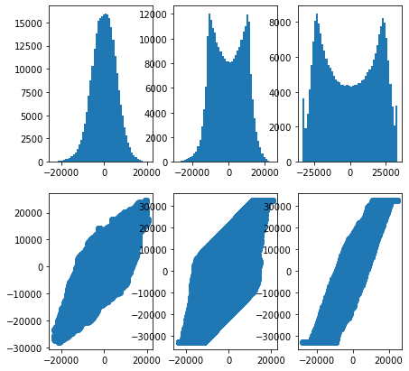
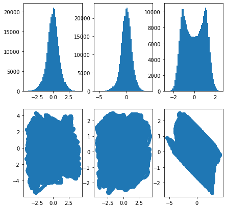
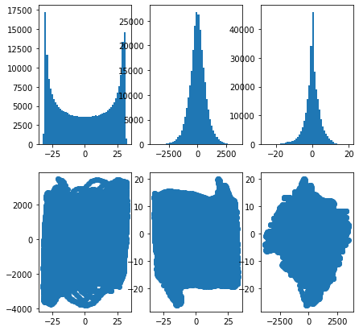

```python
import numpy as np
import pandas as pd
import matplotlib.pyplot as plt
from scipy.io import wavfile
from scipy.linalg import fractional_matrix_power
```


```python

```


```python
store_dataset = pd.read_csv("/home/excelsior/Desktop/JupNoteStanfordCS229/Stores.csv");

store_dataset
```


<div>
<style scoped>
    .dataframe tbody tr th:only-of-type {
        vertical-align: middle;
    }

    .dataframe tbody tr th {
        vertical-align: top;
    }

    .dataframe thead th {
        text-align: right;
    }
</style>
<table border="1" class="dataframe">
  <thead>
    <tr style="text-align: right;">
      <th></th>
      <th>Store ID</th>
      <th>Store_Area</th>
      <th>Items_Available</th>
      <th>Daily_Customer_Count</th>
      <th>Store_Sales</th>
    </tr>
  </thead>
  <tbody>
    <tr>
      <th>0</th>
      <td>1</td>
      <td>1659</td>
      <td>1961</td>
      <td>530</td>
      <td>66490</td>
    </tr>
    <tr>
      <th>1</th>
      <td>2</td>
      <td>1461</td>
      <td>1752</td>
      <td>210</td>
      <td>39820</td>
    </tr>
    <tr>
      <th>2</th>
      <td>3</td>
      <td>1340</td>
      <td>1609</td>
      <td>720</td>
      <td>54010</td>
    </tr>
    <tr>
      <th>3</th>
      <td>4</td>
      <td>1451</td>
      <td>1748</td>
      <td>620</td>
      <td>53730</td>
    </tr>
    <tr>
      <th>4</th>
      <td>5</td>
      <td>1770</td>
      <td>2111</td>
      <td>450</td>
      <td>46620</td>
    </tr>
    <tr>
      <th>...</th>
      <td>...</td>
      <td>...</td>
      <td>...</td>
      <td>...</td>
      <td>...</td>
    </tr>
    <tr>
      <th>891</th>
      <td>892</td>
      <td>1582</td>
      <td>1910</td>
      <td>1080</td>
      <td>66390</td>
    </tr>
    <tr>
      <th>892</th>
      <td>893</td>
      <td>1387</td>
      <td>1663</td>
      <td>850</td>
      <td>82080</td>
    </tr>
    <tr>
      <th>893</th>
      <td>894</td>
      <td>1200</td>
      <td>1436</td>
      <td>1060</td>
      <td>76440</td>
    </tr>
    <tr>
      <th>894</th>
      <td>895</td>
      <td>1299</td>
      <td>1560</td>
      <td>770</td>
      <td>96610</td>
    </tr>
    <tr>
      <th>895</th>
      <td>896</td>
      <td>1174</td>
      <td>1429</td>
      <td>1110</td>
      <td>54340</td>
    </tr>
  </tbody>
</table>
<p>896 rows × 5 columns</p>
</div>


```python
# Store dataset's columns: 

store_dataset_columns = store_dataset.columns.to_numpy();
```


```python
# Convert store_dataset to numpy array:

store_dataset = store_dataset.to_numpy();
```


```python
# Remove <Store ID> column:

store_dataset = store_dataset[:,1:];

# Standardize store_dataset's features:

store_dataset = store_dataset - np.sum(store_dataset,axis=0)/len(store_dataset);

store_dataset_std = np.std(store_dataset, axis=0, ddof = 1);

for col in range(store_dataset.shape[1]):
     store_dataset[:,col] = store_dataset[:,col] / store_dataset_std[col];
        

# Standardized store_dataset's head:

print(store_dataset[:10]);
```

    [[ 0.69370395  0.59680215 -0.96594122  0.41526388]
     [-0.09754592 -0.10016177 -2.17171713 -1.13615258]
     [-0.5810875  -0.57703181 -0.25001178 -0.31070828]
     [-0.13750803 -0.11350079 -0.62681675 -0.32699611]
     [ 1.13728341  1.09701549 -1.2673852  -0.74059083]
     [-0.17347393 -0.16352212 -0.09928979 -0.81970318]
     [ 0.22614721  0.25332233  0.91808363  0.74974625]
     [-0.8967882  -0.91717688  0.88040313 -1.25831136]
     [-1.58014035 -1.53744142 -0.40073377 -0.75862379]
     [-1.81991304 -1.8242304   1.2948886  -0.88427282]]


```python
# Let's rename store_dataset as X for convenience: 

X = store_dataset;
```


```python

```


```python
## PRINCIPAL COMPONENT ANALYSIS ##
```


```python

```


```python
# Compute the correlation matrix of X:

correlation_matrix = (X.T @ X)/(len(X)-1);

correlation_matrix
```


    array([[ 1.        ,  0.99889075, -0.0414231 ,  0.0974738 ],
           [ 0.99889075,  1.        , -0.04097812,  0.09884943],
           [-0.0414231 , -0.04097812,  1.        ,  0.00862871],
           [ 0.0974738 ,  0.09884943,  0.00862871,  1.        ]])


```python
# Order by descending order the eigenvalues/eigenvectors with respect to eigenvalues's values: 

eigendecomposition = np.linalg.eig(correlation_matrix);
eigendecompositon_ordered_indices = eigendecomposition[0].argsort();
eigendecomposition_ordered = [None, None];

eigendecomposition_ordered[0] = eigendecomposition[0][eigendecompositon_ordered_indices][::-1];
eigendecomposition_ordered[1] = eigendecomposition[1][eigendecompositon_ordered_indices][::-1];

# Eigenvalues analysis of the correlation matrix:

eigenvalues = eigendecomposition_ordered[0];

eigenvalues_df = pd.DataFrame(

    {
        "Eigenvalues": eigenvalues,
        "Proportion": eigenvalues/np.sum(eigenvalues),
        "Cumulative": np.cumsum(eigenvalues/np.sum(eigenvalues))
        
    }
    
);

eigenvalues_df.T
```


<div>
<style scoped>
    .dataframe tbody tr th:only-of-type {
        vertical-align: middle;
    }

    .dataframe tbody tr th {
        vertical-align: top;
    }

    .dataframe thead th {
        text-align: right;
    }
</style>
<table border="1" class="dataframe">
  <thead>
    <tr style="text-align: right;">
      <th></th>
      <th>0</th>
      <th>1</th>
      <th>2</th>
      <th>3</th>
    </tr>
  </thead>
  <tbody>
    <tr>
      <th>Eigenvalues</th>
      <td>2.020959</td>
      <td>1.007169</td>
      <td>0.970764</td>
      <td>0.001108</td>
    </tr>
    <tr>
      <th>Proportion</th>
      <td>0.505240</td>
      <td>0.251792</td>
      <td>0.242691</td>
      <td>0.000277</td>
    </tr>
    <tr>
      <th>Cumulative</th>
      <td>0.505240</td>
      <td>0.757032</td>
      <td>0.999723</td>
      <td>1.000000</td>
    </tr>
  </tbody>
</table>
</div>


```python
# Eigenvectors analysis of the correlation matrix:

eigenvectors = eigendecomposition_ordered[1];

eigenvectors_df = pd.DataFrame(data = eigendecomposition_ordered[1].T, index = store_dataset_columns[1:], 
                               columns = ["PC0","PC1","PC2","PC3"]);

eigenvectors_df
```


<div>
<style scoped>
    .dataframe tbody tr th:only-of-type {
        vertical-align: middle;
    }

    .dataframe tbody tr th {
        vertical-align: top;
    }

    .dataframe thead th {
        text-align: right;
    }
</style>
<table border="1" class="dataframe">
  <thead>
    <tr style="text-align: right;">
      <th></th>
      <th>PC0</th>
      <th>PC1</th>
      <th>PC2</th>
      <th>PC3</th>
    </tr>
  </thead>
  <tbody>
    <tr>
      <th>Store_Area</th>
      <td>-0.699590</td>
      <td>-0.134066</td>
      <td>0.055334</td>
      <td>-0.699670</td>
    </tr>
    <tr>
      <th>Items_Available</th>
      <td>-0.707065</td>
      <td>-0.000979</td>
      <td>-0.000303</td>
      <td>0.707148</td>
    </tr>
    <tr>
      <th>Daily_Customer_Count</th>
      <td>-0.101491</td>
      <td>0.835113</td>
      <td>-0.531202</td>
      <td>-0.100550</td>
    </tr>
    <tr>
      <th>Store_Sales</th>
      <td>-0.018234</td>
      <td>0.533490</td>
      <td>0.845436</td>
      <td>-0.017130</td>
    </tr>
  </tbody>
</table>
</div>


```python

```


```python
## INDEPENDENT COMPONENT ANALYSIS ##
```


```python

```


```python
micro1_ica = wavfile.read("/home/excelsior/Desktop/JupNoteStanfordCS229/ICA_mix_1.wav");
micro2_ica = wavfile.read("/home/excelsior/Desktop/JupNoteStanfordCS229/ICA_mix_2.wav");
micro3_ica = wavfile.read("/home/excelsior/Desktop/JupNoteStanfordCS229/ICA_mix_3.wav");
```


```python
print(len(micro1_ica[1]));
print(len(micro2_ica[1]));
print(len(micro3_ica[1]));
```

    264515
    264515
    264515


```python
micro1_ica_data = micro1_ica[1];
micro2_ica_data = micro2_ica[1];
micro3_ica_data = micro3_ica[1];

micros_ica_data = np.c_[micro1_ica_data, micro2_ica_data, micro3_ica_data];
```


```python
fig, ax = plt.subplots(2,3, figsize = (7,7));
ax[0,0].hist(micro1_ica_data, bins =50);
ax[0,1].hist(micro2_ica_data, bins =50);
ax[0,2].hist(micro3_ica_data, bins =50);

ax[1,0].scatter(micro1_ica_data,micro2_ica_data);
ax[1,1].scatter(micro1_ica_data,micro3_ica_data);
ax[1,2].scatter(micro2_ica_data,micro3_ica_data);

```


    

    


```python
# The first step in many ICA algorithms is to remove any correlations in the data.
# i.e. the observed signals are forced to be uncorrelated.

micros_ica_data = micros_ica_data - np.sum(micros_ica_data, axis=0)/len(micros_ica_data);

C = (micros_ica_data.T @ micros_ica_data)/(len(micros_ica_data)-1);

V = fractional_matrix_power(C,-1/2);

Y = micros_ica_data @ V.T;

fig1, ax1 = plt.subplots(2,3, figsize = (7,7));
ax1[0,0].hist(Y[:,0], bins =50);
ax1[0,1].hist(Y[:,1], bins =50);
ax1[0,2].hist(Y[:,2], bins =50);

ax1[1,0].scatter(Y[:,0],Y[:,1]);
ax1[1,1].scatter(Y[:,0],Y[:,2]);
ax1[1,2].scatter(Y[:,1],Y[:,2]);
```


    

    


```python
def gradientLogW(Y_, W):

    m = Y_.shape[0];
    n = Y_.shape[1];
    sum_ = 0;
    
    for i in range(m):
        xi = Y_[i];
            
        for j in range(n):
            cj = np.zeros(n);
            cj[j] = 1;

            sum_ += np.outer(cj,xi)*(1-2*logisticFunction(np.dot(W[j],xi)));
            
    sum_ += sum_ + m*n*np.linalg.inv(W).T;

    return sum_;

def logisticFunction(x):
    
    if x <= -100:
        return 0;
    elif x >= 100:
        return 1;
    else:
        return 1/(1+np.e**(-x));

def gradientAscentW(Y, W, number_of_iterations, alpha):
    
    W_hat_ = W;
    
    for i in range(number_of_iterations):
        W_hat_ = W_hat_ + alpha*gradientLogW(Y, W_hat_);
        
    return W_hat_;
```


```python
alpha = 0.0001;
a1 = np.pi/2;
a2 = 0;
a3 = -np.pi/2;
# W = np.array(
#     [[np.cos(a1)*np.cos(a2), np.cos(a1)*np.sin(a2)*np.sin(a3)-np.sin(a1)*np.cos(a3), np.cos(a1)*np.sin(a2)*np.cos(a3)+np.sin(a1)*np.sin(a3)],
#      [np.sin(a1)*np.cos(a2), np.sin(a1)*np.sin(a2)*np.sin(a3)+np.cos(a1)*np.cos(a3), np.sin(a1)*np.sin(a2)*np.cos(a3)-np.cos(a1)*np.sin(a3)],
#      [-np.sin(a2), np.cos(a2)*np.sin(a3), np.cos(a2)*np.cos(a3)]]
# );

W = np.array([[-32.62237095, -12.47803716, -6.62404943],
              [7.38841354, -12.8469532, -3.93529071],
              [-3.62988946, -7.05053108, 8.65540455]]);


number_of_iterations = 10000;
```


```python
W_test = gradientAscentW(Y, W, number_of_iterations, alpha);
```

    0
    [[-32.62237095 -12.47803716  -6.62404943]
     [  7.38841354 -12.8469532   -3.93529071]
     [ -3.62988946  -7.05053108   8.65540455]]
    **
    1
    [[  2.21852993  -2.57746574   3.30499554]
     [ -7.75322988  17.39756588   9.54409269]
     [  5.90567774   9.1921378  -19.66432409]]
    **
    2
    [[ 12.36038936  21.93584036 -15.40117282]
     [  6.66537043 -11.46962391 -13.60124677]
     [  1.69314396   1.72538155  20.54562632]]
    **
    ...

    **
    159
    [[  -1.94390612    6.70138889   20.23416504]
     [-699.47584295  388.53361308  -51.31278255]
     [ -54.48711373   52.06966783  -14.65314405]]
    **
    160
    [[   2.04470015   -7.06091979  -21.1801987 ]
     [-663.73882185  371.1379278   -50.55638683]
     [ -25.27723208   27.94746594   -8.0587803 ]]
    **
    161
    [[  -1.84492259    6.95447659   20.34597024]
     [-628.04362507  353.69354845  -49.69853837]
     [   2.31885535    3.36939158   -1.16411413]]
    **


    ---------------------------------------------------------------------------

    KeyboardInterrupt                         Traceback (most recent call last)

    Input In [48], in <cell line: 3>()
          1 # More work needs to be done on the algorithm, unsatisfactory operation.
    ----> 3 W_test = gradientAscentW(Y, W, number_of_iterations, alpha)


    Input In [7], in gradientAscentW(Y, W, number_of_iterations, alpha)
         36     print(W_hat_);
         37     print("**");
    ---> 39     W_hat_ = W_hat_ + alpha*gradientLogW(Y, W_hat_);
         41 return W_hat_


    Input In [7], in gradientLogW(Y_, W)
         11         cj = np.zeros(n);
         12         cj[j] = 1;
    ---> 14         sum_ += np.outer(cj,xi)*(1-2*logisticFunction(np.dot(W[j],xi)));
         16 sum_ += sum_ + m*n*np.linalg.inv(W).T;
         18 return sum_


    KeyboardInterrupt: 


```python
# W_test = W;

W_test = np.array([[-1.84492259, 6.95447659, 20.34597024],
                   [-628.04362507, 353.69354845, -49.69853837],
                   [2.31885535, 3.36939158, -1.16411413]]);

S_hat = Y @ W_test.T;
```


```python
fig2, ax2 = plt.subplots(2,3, figsize = (7,7));
ax2[0,0].hist(S_hat[:,0], bins =50);
ax2[0,1].hist(S_hat[:,1], bins =50);
ax2[0,2].hist(S_hat[:,2], bins =50);

ax2[1,0].scatter(S_hat[:,0],S_hat[:,1]);
ax2[1,1].scatter(S_hat[:,0],S_hat[:,2]);
ax2[1,2].scatter(S_hat[:,1],S_hat[:,2]);
```


    

    


```python
# Recover and rebuild the original sources disentangle;

S1 = S_hat/1000;

wavfile.write("/home/excelsior/Desktop/JupNoteStanfordCS229/speaker_1_S1.wav", micro1_ica[0], S1[:,0]);
wavfile.write("/home/excelsior/Desktop/JupNoteStanfordCS229/speaker_2_S1.wav", micro2_ica[0], S1[:,1]);
wavfile.write("/home/excelsior/Desktop/JupNoteStanfordCS229/speaker_3_S1.wav", micro3_ica[0], S1[:,2]);
```
