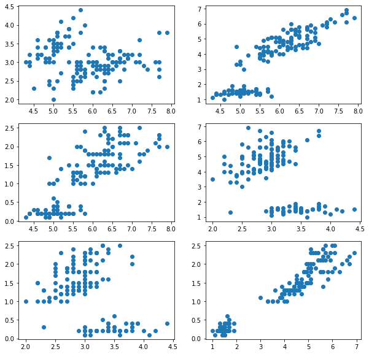
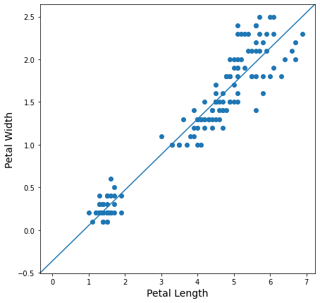

```python
import matplotlib as mpl
import matplotlib.pyplot as plt
import numpy as np
from sklearn import datasets as ds
```


```python
iris = ds.load_iris();
```


```python
i_d = iris.data;
```


```python
print(iris.DESCR);
```

    .. _iris_dataset:
    
    Iris plants dataset
    --------------------
    
    **Data Set Characteristics:**
    
        :Number of Instances: 150 (50 in each of three classes)
        :Number of Attributes: 4 numeric, predictive attributes and the class
        :Attribute Information:
            - sepal length in cm
            - sepal width in cm
            - petal length in cm
            - petal width in cm
            - class:
                    - Iris-Setosa
                    - Iris-Versicolour
                    - Iris-Virginica
                    
        :Summary Statistics:
    
        ============== ==== ==== ======= ===== ====================
                        Min  Max   Mean    SD   Class Correlation
        ============== ==== ==== ======= ===== ====================
        sepal length:   4.3  7.9   5.84   0.83    0.7826
        sepal width:    2.0  4.4   3.05   0.43   -0.4194
        petal length:   1.0  6.9   3.76   1.76    0.9490  (high!)
        petal width:    0.1  2.5   1.20   0.76    0.9565  (high!)
        ============== ==== ==== ======= ===== ====================
    
        :Missing Attribute Values: None
        :Class Distribution: 33.3% for each of 3 classes.
        :Creator: R.A. Fisher
        :Donor: Michael Marshall (MARSHALL%PLU@io.arc.nasa.gov)
        :Date: July, 1988
    
    The famous Iris database, first used by Sir R.A. Fisher. The dataset is taken
    from Fisher's paper. Note that it's the same as in R, but not as in the UCI
    Machine Learning Repository, which has two wrong data points.
    
    This is perhaps the best known database to be found in the
    pattern recognition literature.  Fisher's paper is a classic in the field and
    is referenced frequently to this day.  (See Duda & Hart, for example.)  The
    data set contains 3 classes of 50 instances each, where each class refers to a
    type of iris plant.  One class is linearly separable from the other 2; the
    latter are NOT linearly separable from each other.
    
    .. topic:: References
    
       - Fisher, R.A. "The use of multiple measurements in taxonomic problems"
         Annual Eugenics, 7, Part II, 179-188 (1936); also in "Contributions to
         Mathematical Statistics" (John Wiley, NY, 1950).
       - Duda, R.O., & Hart, P.E. (1973) Pattern Classification and Scene Analysis.
         (Q327.D83) John Wiley & Sons.  ISBN 0-471-22361-1.  See page 218.
       - Dasarathy, B.V. (1980) "Nosing Around the Neighborhood: A New System
         Structure and Classification Rule for Recognition in Partially Exposed
         Environments".  IEEE Transactions on Pattern Analysis and Machine
         Intelligence, Vol. PAMI-2, No. 1, 67-71.
       - Gates, G.W. (1972) "The Reduced Nearest Neighbor Rule".  IEEE Transactions
         on Information Theory, May 1972, 431-433.
       - See also: 1988 MLC Proceedings, 54-64.  Cheeseman et al"s AUTOCLASS II
         conceptual clustering system finds 3 classes in the data.
       - Many, many more ...


```python
species = np.concatenate((0*np.ones(50), 1*np.ones(50), 2*np.ones(50)));
```


```python
i_ds = np.c_[i_d, species];
```


```python
petalw_mean = i_ds[:,3].mean();
species_mean = i_ds[:,4].mean();

cor_numerator = np.sum((i_ds[:,3] - petalw_mean)*(i_ds[:,4] - species_mean));
cor_denominator = np.sqrt(np.sum( (i_ds[:,3] -  petalw_mean)**2 ) * np.sum( (i_ds[:,4] - species_mean)**2 ));

cor = cor_numerator / cor_denominator;
cor
```


    0.9565473328764029


```python
fig, axes = plt.subplots(3,2, figsize = (10,10));

axes[0,0].scatter(i_d[:,0], i_d[:,1]); # sl - sw
axes[0,1].scatter(i_d[:,0], i_d[:,2]); # sl - pl
axes[1,0].scatter(i_d[:,0], i_d[:,3]); # sl - pw
axes[1,1].scatter(i_d[:,1], i_d[:,2]); # sw - pl
axes[2,0].scatter(i_d[:,1], i_d[:,3]); # sw - pw
axes[2,1].scatter(i_d[:,2], i_d[:,3]); # pl - pw 
```


    <matplotlib.collections.PathCollection at 0x7f1da2151580>


    

    


```python
petal_length = i_d[:,2];
petal_width = i_d[:,3];

fig2, ax = plt.subplots(figsize = (7,7));
ax.scatter(petal_length, petal_width);
ax.set_xlabel('Petal Length', fontsize = 14);
ax.set_ylabel('Petal Width', fontsize = 14);

ax.axline((0, -0.36307552), slope = 0.41575542);
```


    <matplotlib.lines._AxLine at 0x7f1da20e6340>


    

    


```python
ds = np.c_[np.ones(150),i_d[:,(2,3)]];
```


```python
## Batch gradient descent algorithm for linear regression

# Correction : In the literature what is named the design matrix is the matrix I named indep_v.  

def batchGradientDescent(designMatrix):
    number_of_indep_v = designMatrix.shape[1] - 1;
    init_param = np.zeros(number_of_indep_v);
    alpha = 0.0001;
    indep_v = designMatrix[:,0:-1];
    dep_v = designMatrix[:,-1];
    
    theta = init_param;
    for iteration in range(10000):
        
        theta_t = theta.copy();
        for j in range(len(theta)):
            theta[j] = theta[j] - alpha*( np.sum( (np.matmul(indep_v, theta_t) - dep_v)*designMatrix[:,j] ) );
    
    print(theta);
```


```python
batchGradientDescent(ds);
```

    [-0.36307552  0.41575542]


```python
iv = ds[:,0:-1];
dv = ds[:,-1];

target_theta = np.matmul(np.matmul(np.linalg.inv(np.matmul(iv.T,iv)),iv.T), dv);

print(target_theta);
```

    [-0.36307552  0.41575542]

