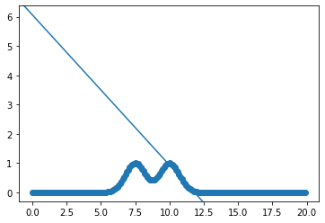
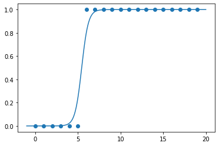

```python
import numpy as np
import matplotlib.pyplot as plt
from sklearn import datasets as ds
```


```python

```


```python
## LOCALLY WEIGHTED LINEAR REGRESSION 
```


```python

```


```python
x = np.arange(0,20,0.1);
dset = np.c_[x, np.exp(-(x-7.5)**2) + np.exp(-(x-10)**2)];
```


```python
nbr_training_examples = dset.shape[0];
designMatrix = np.c_[np.ones(nbr_training_examples), dset];
```


```python
fig, ax = plt.subplots();
ax.scatter(dset[:,0], dset[:,1]);
ax.axline([0,6.07282451], slope = -0.51403871);
```


    

    


```python
# BATCH GRADIENT DESCENT - (LOCALLY WEIGHTED) LINEAR REGRESSION. (if inFeaturesVector and tau are defined)

# Correction : In the literature what is named the design matrix is the matrix I named indep_v. 

def batchGradientDescent(designMatrix, alpha, nbrOfIteration, inFeaturesVector = None, tau = None):
    number_of_indep_v = designMatrix.shape[1] - 1;
    init_param = np.zeros(number_of_indep_v);
    
    alpha = alpha;
    tau = tau;
    
    indep_v = designMatrix[:,0:-1];
    dep_v = designMatrix[:,-1];
    
    dist = ( designMatrix[:,1:-1] - inFeaturesVector if inFeaturesVector else None );
    weighting = ( np.exp(-np.sum(dist**2, axis = 1)/(2*tau**2)) if tau else np.ones(designMatrix.shape[0]) );
    
    theta = init_param;
    for iteration in range(nbrOfIteration):
        
        theta_t = theta.copy();
        for j in range(len(theta)):
            theta[j] = theta_t[j] - alpha*( np.sum( weighting*(np.matmul(indep_v, theta_t) - dep_v)*designMatrix[:,j] ) );

            
    print(theta);
```


```python
batchGradientDescent(designMatrix, 0.0001, 1000000, 11, 0.5);
```

    [ 6.07282451 -0.51403871]


```python

```


```python
## LOGISTIC REGRESSION 
```


```python

```


```python
col_1 = np.ones(20);
col_2 = np.arange(20);
col_3 = 1/(1 + np.exp(-2*(col_2 - 5)));

for i in range(len(col_3)): col_3[i] = (1 if col_3[i] > 1/2 else 0);
    
designMatrix1 = np.c_[col_1, col_2, col_3];
designMatrix1
```


    array([[ 1.,  0.,  0.],
           [ 1.,  1.,  0.],
           [ 1.,  2.,  0.],
           [ 1.,  3.,  0.],
           [ 1.,  4.,  0.],
           [ 1.,  5.,  0.],
           [ 1.,  6.,  1.],
           [ 1.,  7.,  1.],
           [ 1.,  8.,  1.],
           [ 1.,  9.,  1.],
           [ 1., 10.,  1.],
           [ 1., 11.,  1.],
           [ 1., 12.,  1.],
           [ 1., 13.,  1.],
           [ 1., 14.,  1.],
           [ 1., 15.,  1.],
           [ 1., 16.,  1.],
           [ 1., 17.,  1.],
           [ 1., 18.,  1.],
           [ 1., 19.,  1.]])


```python
theta_0 = -14.01576097;
theta_1 = 2.57244533;

x = np.linspace(-1, 20, 200);
y = 1/(1+np.exp(-(theta_0 + theta_1*x)));

fig2, ax2 = plt.subplots();
ax2.scatter(col_2, col_3);
ax2.plot(x,y);
```


    

    


```python
def logisticFunction(x, theta):
    return 1/(1+np.exp(-(np.matmul(x, theta))));
```


```python
# BATCH GRADIENT ASCENT FOR LOGISTIC REGRESSION

# Correction : In the literature what is named the design matrix is the matrix I named indep_v. 

def bgaLogisticr(designMatrix, nbrOfIteration, alpha):
    number_of_indep_v = designMatrix.shape[1] - 1;
    init_param = np.zeros(number_of_indep_v);

    indep_v = designMatrix[:,0:-1];
    dep_v = designMatrix[:,-1];

    theta = init_param;
    for iteration in range(nbrOfIteration):
        
        theta_t = theta.copy();
        for j in range(len(theta)):
            theta[j] = theta_t[j] + alpha*(np.sum((dep_v - logisticFunction(indep_v, theta_t))*designMatrix[:,j]));
            
    print(theta);
```


```python
bgaLogisticr(designMatrix1, 100000, 0.001);
```

    [-14.01576097   2.57244533]


```python
# NEWTON'S METHOD FOR LOGISTIC REGRESSION

# Correction : In the literature what is named the design matrix is the matrix I named indep_v. 

def newtonLogisticr(designMatrix, nbrOfIteration, theta_init):
    indep_var = designMatrix[:,0:-1];
    dep_var = designMatrix[:,-1];

    theta = theta_init.copy();
    for iteration in range(nbrOfIteration):

        lf = logisticFunction(indep_var, theta);

        #GRADIENT
        gradient = np.matmul((dep_var - lf).T, indep_var).T;
        
        #HESSIAN
        middle_matrix = np.diag(lf*(1-lf));        
        hessian_matrix = - np.matmul(np.matmul(indep_var.T, middle_matrix),indep_var);

        theta = theta - np.matmul(np.linalg.inv(hessian_matrix), gradient);
        
        log_likelihood_theta = logLikelihoodTheta(designMatrix, theta);

        if log_likelihood_theta:
            print("theta ", theta, "** loglikehood ", log_likelihood_theta);
        else:
            break;
            

def logLikelihoodTheta(designMatrix, theta):
    indep_var = designMatrix[:,0:-1];
    dep_var = designMatrix[:,-1];
    
    lf = logisticFunction(indep_var, theta);
    
    if np.isin(0,lf) or np.isin(1,lf):
        return False;        
    
    return np.dot(dep_var, np.log(lf)) + np.dot((1-dep_var), np.log(1-lf));
```


```python
newtonLogisticr(designMatrix1, 10, [0,0]);
```

    theta  [-1.6         0.25263158] ** loglikehood  -5.774132716697398
    theta  [-2.7075695   0.45138616] ** loglikehood  -3.561042641625019
    theta  [-4.13082081  0.71783283] ** loglikehood  -2.2695433974953145
    theta  [-6.1859172   1.10334666] ** loglikehood  -1.450121940655539
    theta  [-9.29747881  1.67870077] ** loglikehood  -0.9111774281647126
    theta  [-14.20824959   2.57697379] ** loglikehood  -0.532121475482736

