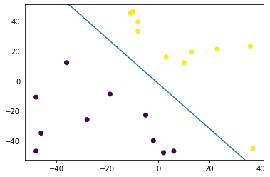
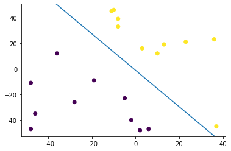
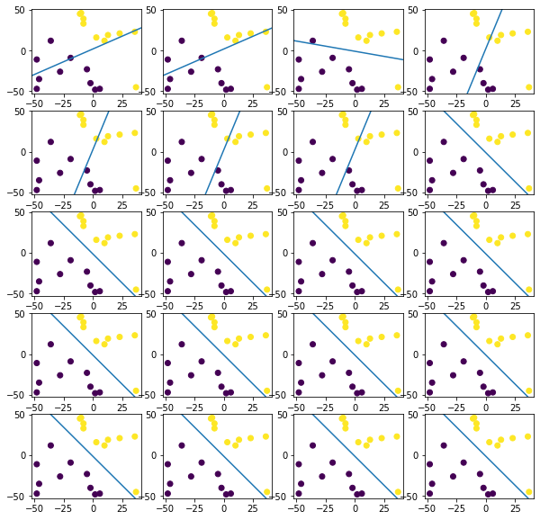

```python
import numpy as np
import matplotlib.pyplot as plt
```


```python

```


```python
# PERCEPTRON LEARNING ALGORITHM
```


```python

```


```python
x1,x2,b = (3,2,4);
rng = np.random.default_rng();

m = 20; # number of training examples
n = 2 + 1 + 1; # features + intercept + label 

training_set = np.ndarray((m,n));

for i in range(m):
    x, y = rng.integers(-50, 50, 2, endpoint=True);
    
    if x1*x + x2*y + b >= 0:
        training_set[i] = [x,y,1,1];
    else:
        training_set[i] = [x,y,1,0];

print(training_set);
```

    [[-19.  -9.   1.   0.]
     [  2. -48.   1.   0.]
     [ 37. -45.   1.   1.]
     [-36.  12.   1.   0.]
     [-48. -47.   1.   0.]
     [-28. -26.   1.   0.]
     [ -8.  39.   1.   1.]
     [ 13.  19.   1.   1.]
     [ 10.  12.   1.   1.]
     [  3.  16.   1.   1.]
     [-11.  45.   1.   1.]
     [ 36.  23.   1.   1.]
     [-48. -11.   1.   0.]
     [ -2. -40.   1.   0.]
     [-10.  46.   1.   1.]
     [ -5. -23.   1.   0.]
     [-46. -35.   1.   0.]
     [ 23.  21.   1.   1.]
     [  6. -47.   1.   0.]
     [ -8.  33.   1.   1.]]


```python
fig, ax = plt.subplots();
ax.scatter(training_set[:,0],training_set[:,1], c=training_set[:,3]);
ax.axline((0,-2), slope = -3/2);
# ax.axline((0,15/8), slope = 5/8) ## theta_init = (5,-8,15)
```


    <matplotlib.lines._AxLine at 0x7fd5c482a790>


    

    


```python
def h_theta(theta,x):
    if np.dot(theta, x) >= 0:
        return 1;
    else:
        return 0;
```


```python
theta_init = (5,-8,15);
theta = theta_init;

r = 0.5; # learning rate
thetas_array = np.array([[5,-8,15]]);

for point in range(len(training_set)):
    features_vector = training_set[point,0:3];
    theta = theta + r * (training_set[point,3] - h_theta(theta,features_vector))*features_vector;
    thetas_array = np.append(thetas_array, [theta], axis = 0);
    

fig1, ax1 = plt.subplots();
ax1.scatter(training_set[:,0],training_set[:,1], c=training_set[:,3]);
ax1.axline((0, -theta[2]/theta[1]), slope = -theta[0]/theta[1]);
```


    <matplotlib.lines._AxLine at 0x7fd5c26cec70>


    

    


```python
fig1, axes = plt.subplots(5,4, figsize=(10,10));

for row in range(5):
    for col in range(4):
        i = (row*4)+col;
        axes[row, col].scatter(training_set[:,0],training_set[:,1], c=training_set[:,3]);
        axes[row, col].axline((0, -thetas_array[i,2]/thetas_array[i,1]), slope = -thetas_array[i,0]/thetas_array[i,1]);
```


    

    

