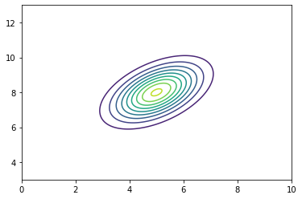
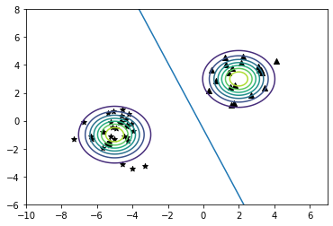

```python
import numpy as np
import matplotlib.pyplot as plt
import matplotlib as mpl
```


```python

```


```python
# MULTIVARIATE GAUSSIAN DISTRIBUTION
```


```python

```


```python
def multivariateGaussianContour(mean, covariance_matrix):

    µ = np.array(mean);
    X = np.linspace(µ[0]-5, µ[0]+5, 256);
    Y = np.linspace(µ[1]-5, µ[1]+5, 256);
    Z = np.ndarray((256,256));

    cov_matrix = np.array(covariance_matrix);
    cov_matrix_inv = np.linalg.inv(cov_matrix);
    cov_matrix_det = np.linalg.det(cov_matrix);
    const = (1/(2*np.pi*np.sqrt(np.abs(cov_matrix_det))));

    for i in range(256):
        for j in range(256):
            V = np.array([X[i], Y[j]]);
            Z[i,j] = const*np.exp((-1/2)*np.matmul(np.matmul((V-µ).T, cov_matrix_inv),(V-µ)));
            
    return (X,Y,Z);

X,Y,Z = multivariateGaussianContour([5,8], [[1,0.5],[0.5,1]]);
fig1, ax1 = plt.subplots();
ax1.contour(X,Y,Z, levels = 10);
```


    

    


```python

```


```python
# GDA - GAUSSIAN DISCRIMINANT ANALYSIS
```


```python

```


```python
rng = np.random.default_rng();
m0 = 20; # Number of examples from the multivariate gaussian with mean µ0
m1 = 35; # Number of examples from the multivariate gaussian with mean µ1

µ0 = [2,3];
µ1 = [-5,-1];
cov = [[1,0],[0,1]];
phi = 1/2;

arr0 = np.c_[rng.multivariate_normal(µ0, cov, m0), np.zeros(m0)];
arr1 = np.c_[rng.multivariate_normal(µ1, cov, m1), np.ones(m1)];

arr = np.r_[arr0,arr1];

X0,Y0,Z0 = multivariateGaussianContour(µ0,cov);
X1,Y1,Z1 = multivariateGaussianContour(µ1,cov);
```


```python
trainingset_size = arr.shape[0];

phi_sample = np.sum(arr[:,2])/trainingset_size;

zero_labeled_examples = arr[arr[:,2] == 0][:,0:2];
µ0_sample = µ0_s = np.sum(zero_labeled_examples, axis = 0)/zero_labeled_examples.shape[0];

one_labeled_examples = arr[arr[:,2] == 1][:,0:2];
µ1_sample = µ1_s = np.sum(one_labeled_examples, axis = 0)/one_labeled_examples.shape[0];

cov_sample = np.zeros((2,2));

for i in range(trainingset_size):
    mu = µ0_sample if arr[i,2] == 0 else µ1_sample;
    cov_sample += np.outer(arr[i,0:2] - mu, arr[i,0:2] - mu);
    
cov_sample = cov_sample/trainingset_size;
cov_sample_inv = csi = np.linalg.inv(cov_sample);

# pyOne(x) := p(y=1 | x) - Probability that the label of y is equals to 1 given x; 

def pyOne(x):
    return 1/(1 + np.exp((-µ1_s@csi + µ0_s@csi) @ x + (1/2)*µ1_s@csi@µ1_s -(1/2)*µ0_s@csi@µ0_s + np.log((1-phi)/phi)));

1- pyOne([2,3]) # Probability that the point [2,3] has label 0;
```


    0.9999999999999993


```python
# Let's find the boundary decision, i.e. the line where p(y=1 | x) = 1/2;
# The code was derived from solving p(y=1 | x) = 1/2 for x;

v = (-µ1_s@csi + µ0_s@csi);
w = np.log(1/((1/2)*µ1_s@csi@µ1_s -(1/2)*µ0_s@csi@µ0_s + np.log((1-phi)/phi)));

print("v :",v);
print("w :",w);

# The line is : x_2 = w/v[1] -(v[0]/v[1])*x_1
```

    v : [8.23747236 3.47194394]
    w : -2.0832166106101933


```python
fig2, ax2 = plt.subplots();
ax2.scatter(arr0[:,0],arr0[:,1], c="black", marker="^");
ax2.scatter(arr1[:,0],arr1[:,1], c="black", marker="*");

ax2.contour(X0,Y0,Z0);
ax2.contour(X1,Y1,Z1);

# x_2 = w/v[1] -(v[0]/v[1])*x_1
ax2.axline((0,w/v[1]), slope = -(v[0]/v[1]));
```


    

    

