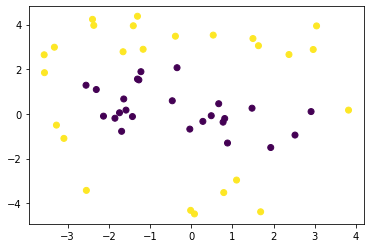

```python
import numpy as np
import matplotlib.pyplot as plt
```


```python

```


```python
## SVM via SMO algorithm;
```


```python

```


```python
rng = np.random.default_rng();
m_0 = 25; # number of negative examples;
m_1 = 25; # number of positive examples;
radius_inner_circle = 3;
radius_outer_circle = [radius_inner_circle,5]; # radius from radius_inner_circle to 5;


training_set_0 = np.c_[rng.normal(size=(m_0, 2)), -np.ones(m_0)];

for i in range(m_0):
    r = radius_inner_circle*rng.random(1);
    x = training_set_0[i,0];
    y = training_set_0[i,1];
    
    
    training_set_0[i,0] = r*x/np.sqrt(x**2+y**2);
    training_set_0[i,1] = r*y/np.sqrt(x**2+y**2);
    
training_set_1 = np.c_[rng.normal(size=(m_1, 2)), np.ones(m_1)];

for i in range(m_1):
    r = radius_outer_circle[0] + (radius_outer_circle[1] - radius_outer_circle[0])*rng.random(1);
    x = training_set_1[i,0];
    y = training_set_1[i,1];
    
    
    training_set_1[i,0] = r*x/np.sqrt(x**2+y**2);
    training_set_1[i,1] = r*y/np.sqrt(x**2+y**2);

training_set = np.r_[training_set_0, training_set_1];
```


```python
fig, ax = plt.subplots();
ax.scatter(training_set[:,0], training_set[:,1], c = training_set[:,2]);
```


    

    


```python
m = len(training_set);
alpha = np.zeros(m);
tol = 0.1; # numerical tolerance
C = 2; # regularization parameter
b = 0; # bias
count = 10000;
```


```python
def KKT(alphai, i):
    
    yi = training_set[i,2];
    xi = training_set[i,0:2];
    
    if alphai == 0 and yi*f(xi) + tol >= 1 :
        return True;
        
    elif alphai == C and yi*f(xi) - tol <= 1 :
        return True;
    
    elif alphai > 0 and alphai < C and np.abs(yi*f(xi) - 1) <= tol :
        return True;
    
    return False;
        

def f(x):
    # Use of the transformation phi(x) = [x_1, x_2, ||x||²]
    
    sum = 0;
    for i in range(m):
        yi = training_set[i,2];
        xi = training_set[i,0:2];
        sum += alpha[i]*yi*K(xi,x);
    
    return sum + b;

def randomIndex(index):
    
    random_number = 0;    
    while(True):
        random_number = rng.integers(0,m,1);
        if random_number != index:
            break;
    return random_number;

def K(xi,xj):
    return (xi[0]*xj[0] + xi[1]*xj[1] + np.linalg.norm(xi)**2 * np.linalg.norm(xj)**2);
```


```python
while(count > 0):
    count -= 1;    
    
    alphai_opt = 0;
    isOptimal = True;
    
    for i in range(m):
        if KKT(alpha[i],i) is False:
            isOptimal = False;
            alphai_opt = (int(alpha[i]), i);
            break;
    
    if isOptimal == True: 
        print("OPTIMAL");
        break;
        
    random_number = randomIndex(alphai_opt[1]);
    alphaj_opt = (int(alpha[random_number]), int(random_number));
    
    yi = training_set[alphai_opt[1],2];
    yj = training_set[alphaj_opt[1],2];
    xi = training_set[alphai_opt[1],0:2];
    xj = training_set[alphaj_opt[1],0:2];

    L = 0;
    H = 0;
    
    if yi != yj:
        L = np.maximum(0,alphaj_opt[0] - alphai_opt[0]);
        H = np.minimum(C, C + alphaj_opt[0] - alphai_opt[0]);
    else:
        L = np.maximum(0, alphaj_opt[0] + alphai_opt[0] - C);
        H = np.minimum(C, alphaj_opt[0] + alphai_opt[0]);
    
    aj_old = alpha[alphaj_opt[1]];
    eta = 2*K(xi,xj)-K(xi,xi)-K(xj,xj);
    if eta == 0: continue;
    alpha[alphaj_opt[1]] = alpha[alphaj_opt[1]] - yj*((f(xi) - yi)-(f(xj) - yj))/eta;    
    
    aj_new = alpha[alphaj_opt[1]];
    if aj_new > H:
        alpha[alphaj_opt[1]] = aj_new = H;
    elif aj_new < L:
        alpha[alphaj_opt[1]] = aj_new = L;
    
    ai_old = alpha[alphai_opt[1]];
    alpha[alphai_opt[1]] = ai_new = alpha[alphai_opt[1]] + yi*yj*(aj_old - aj_new);
    
    
    b1 = b - (f(xi) - yi) - yi*(ai_new - ai_old)*K(xi,xi) - yj*(aj_new - aj_old)*K(xi,xj);
    b2 = b - (f(xj) - yj) - yi*(ai_new - ai_old)*K(xi,xj) - yj*(aj_new - aj_old)*K(xj,xj);
    
    if ai_new > 0 and ai_new < C:
        b = b1;
    elif aj_new > 0 and aj_new < C:
        b = b2;
    else:
        b = (b1+b2)/2;

print("alpha:",alpha);
print("b:",b);
```

    alpha: [0.         0.00292933 0.         0.11004115 0.         0.
     0.         0.         0.         0.         0.         0.
     0.         0.         0.         0.         0.         0.
     0.         0.         0.         0.         0.         0.
     0.         0.         0.         0.0225054  0.         0.
     0.         0.         0.         0.         0.         0.
     0.         0.         0.         0.         0.         0.
     0.         0.         0.09046508 0.         0.         0.
     0.         0.        ]
    b: -2.736340214596609


```python
A1 = 0;
A2 = 0;
A3 = 0;

for i in range(m):
    ai = alpha[i];
    yi = training_set[i,2];
    
    A1 += ai*yi*training_set[i,0];
    A2 += ai*yi*training_set[i,1];
    A3 += ai*yi*np.linalg.norm(training_set[i,0:2])**2;
    
print("A1:",A1);
print("A2:",A2);
print("A3:",A3);
```

    A1: 0.05042331162508863
    A2: 0.06678894161300489
    A3: 0.5139305597916887

